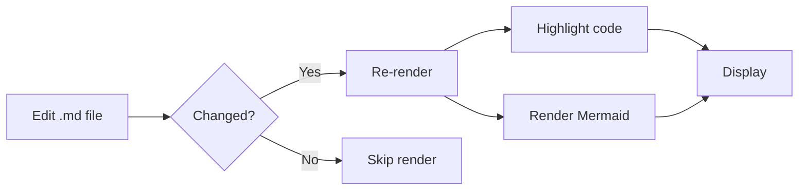
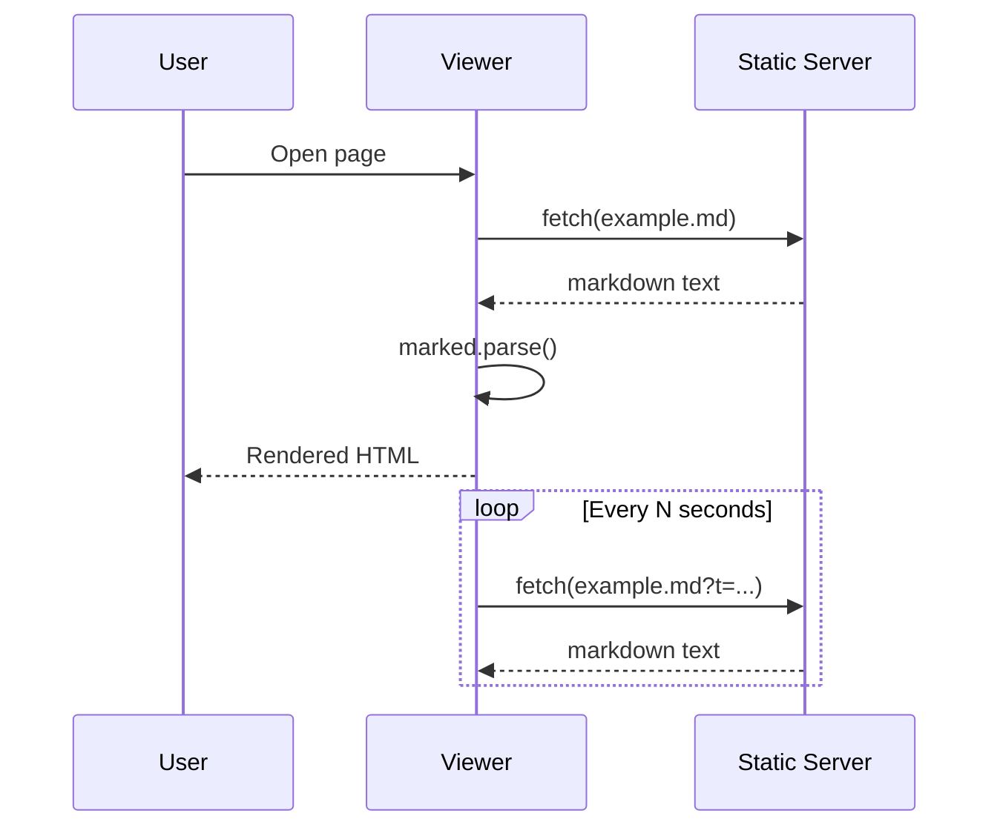

# Live Markdown Viewer — Feature Demo

A split-pane markdown viewer with live reload, syntax highlighting, Mermaid diagrams, and light/dark themes. This document exercises every feature so it doubles as a visual test.

---

## Text Formatting

You can write **bold**, *italic*, ***bold italic***, ~~strikethrough~~, and `inline code`. Combine them: a **bold `code` snippet** inside a sentence.

> Blockquotes render with a styled left border.
>
> > Nested blockquotes are supported too.
>
> — Someone, probably

---

## Lists

### Unordered

- Split pane: raw markdown (left) + rendered (right)
- Resizable center divider — drag to resize
  - Nested item
  - Another nested item
    - Even deeper
- Configurable auto-refresh interval

### Ordered

1. Drop a `.md` file into `output/`
2. Serve with a static file server
3. Open the page in your browser
   1. Pick a file from the dropdown
   2. Toggle the theme

### Task List

- [x] Split pane (raw + rendered)
- [x] Resizable divider
- [x] Auto-refresh
- [x] Syntax highlighting
- [x] Mermaid diagrams
- [ ] World domination

---

## Tables

Tables get Bootstrap styling automatically.

| Feature                     | Status | Notes                          |
|-----------------------------|--------|--------------------------------|
| Split pane (raw + rendered) | Done   | Resizable divider              |
| Auto-refresh                | Done   | 5s / 10s / 30s / 60s           |
| File selector               | Done   | Auto-discovers `.md` files     |
| Syntax highlighting         | Done   | highlight.js, GitHub themes    |
| Mermaid diagrams            | Done   | Flowcharts, sequence, etc.     |
| Theme toggle                | Done   | Light / dark                   |

---

## Code Blocks

Fenced code blocks are syntax-highlighted via highlight.js.

### JavaScript

```javascript
async function load(mdFile) {
  const res = await fetch(mdFile + '?t=' + Date.now());
  if (!res.ok) throw new Error(`Not found: ${mdFile}`);
  const md = await res.text();
  document.getElementById('rendered').innerHTML = marked.parse(md);
}
```

### Python

```python
from pathlib import Path

def list_markdown(folder: str) -> list[str]:
    """Return all markdown files in a folder, sorted."""
    return sorted(p.name for p in Path(folder).glob("*.md"))

if __name__ == "__main__":
    for name in list_markdown("output"):
        print(name)
```

### Bash

```bash
# Serve the viewer locally
python3 -m http.server 8080 --bind 127.0.0.1
open http://localhost:8080
```

### JSON

```json
{
  "files": ["example.md", "notes.md"],
  "theme": "dark",
  "refreshIntervalMs": 10000
}
```

---

## Mermaid Diagrams

### Flowchart



### Sequence Diagram



---

## Links and Images

- Inline link: [marked.js](https://github.com/markedjs/marked)
- Reference link: [Bootstrap][bs]


[bs]: https://getbootstrap.com/

---

## Inline HTML

You can drop in raw HTML when markdown isn't enough:

<div align="center">
  <strong>Centered bold text via inline HTML</strong>
</div>

---

## Horizontal Rules

Three or more dashes create a horizontal rule (used throughout this doc):

---

That's the full feature tour. Edit this file or drop new `.md` files into `output/` to see live reload in action.
